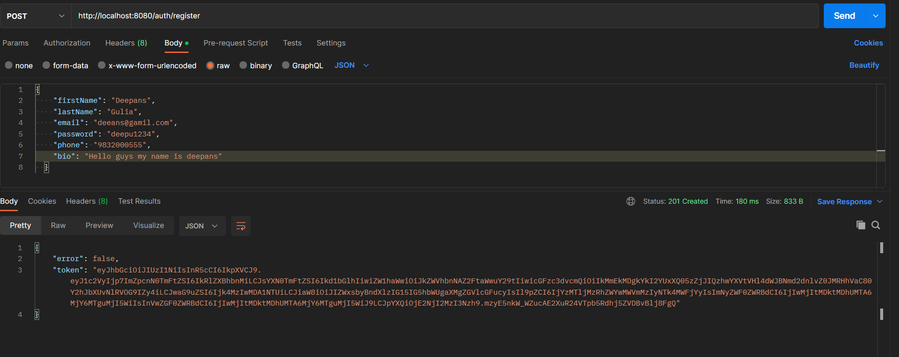
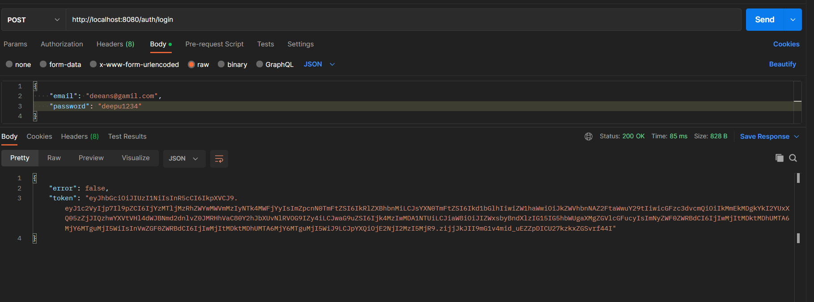
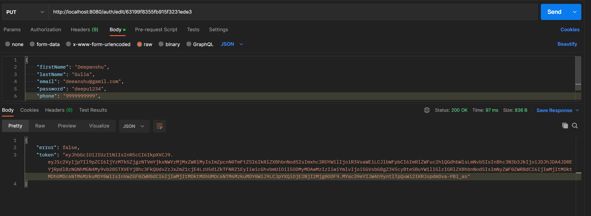
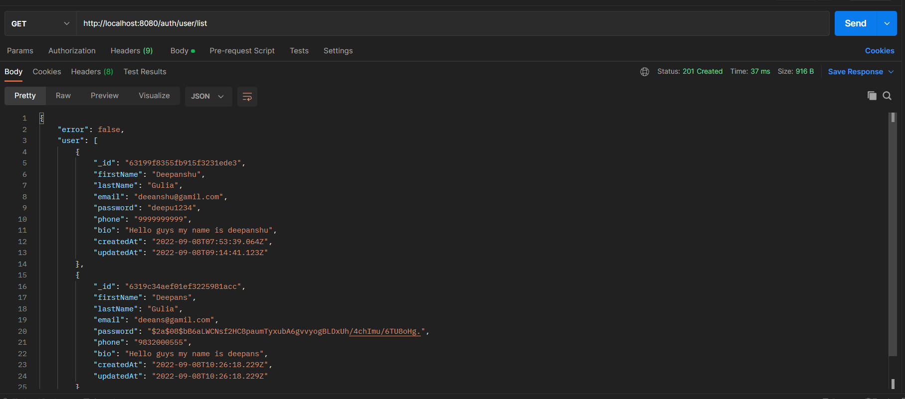
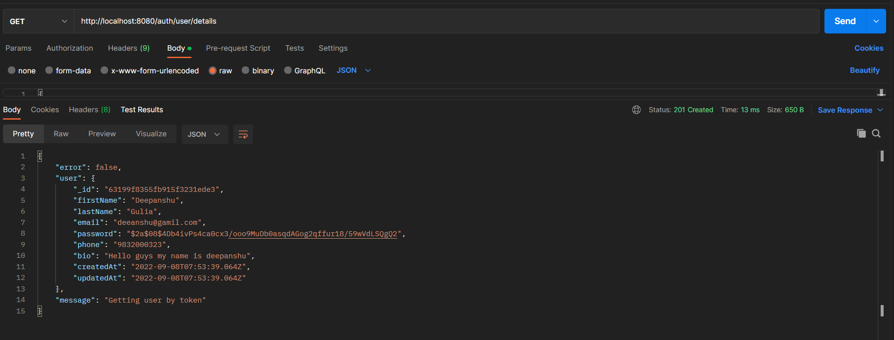

# user-profile
This is MERN full stack project. In this you can see dashboard for user. After login you can see user profile page and one list page in which you can see all users list and also your profile page too.

## Steps to run application on local server

* Clone this repository locally than to following for starting local server for backend or frontend.
  
 * <kbd>npm start</kbd> ==> After cloning this repository you can run npm start in terminal to start server on localhost.
 
 *<kbd>npm run dev</kbd> ==> TO start reactjs server go to Frontend folder and then run this command to start reactjs server and then go to http://localhost:5173/

## TechStacks
* NodeJS
* JavaScript
* express
* Mongodb
* Mongoose
* cors
* nodemon
* Reactjs
* React-Router
* React-Redux

# Features

* ##  Register new user 

* ## Login with user of email and password

* ##  Editing user data

* ##  Getting list of users data in database

* ##  Getting user data by token

Thank you ❤️
